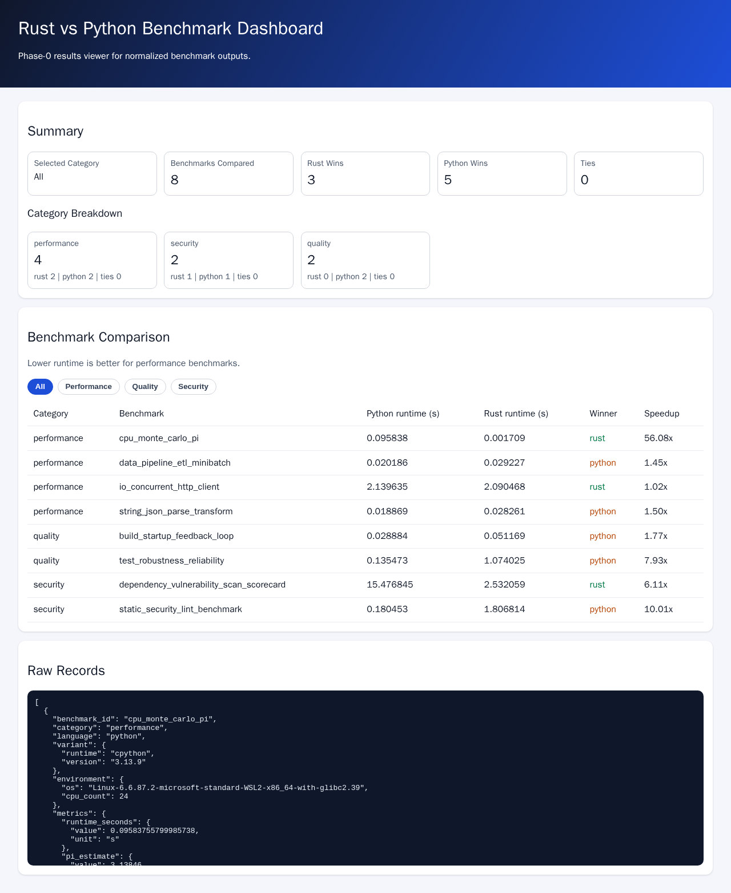

# Rust vs Python Demo

End-to-end benchmarking scaffold comparing Python and Rust across performance, security, and quality metrics.

## What is implemented

- Monorepo directory layout from `IMPLEMENTATION_PLAN.md`.
- Full 8-test benchmark matrix from the implementation plan (4 performance, 2 security, 2 quality).
- Shared workload plumbing so Python and Rust run against the same HTTP mock service and ETL dataset.
- Shared JSON schema and validator.
- Cross-language parity validation for deterministic performance metrics (checksum/count consistency).
- Cross-language orchestrator script.
- Browser dashboard UI that loads normalized results, supports category tabs, and renders category-aware summaries.

`python3 benchmarks/shared/scripts/run_all.py` writes:
- `results/raw/python_perf.json`
- `results/raw/rust_perf.json`
- `results/normalized/latest.json` (16 records: 8 benchmark IDs x 2 languages)

## Quick start

```bash
python3 -m venv .venv
source .venv/bin/activate
pip install -r benchmarks/python/requirements.txt
python3 benchmarks/shared/scripts/run_all.py
```

## Latest benchmark results (2026-03-01)

Source: `results/normalized/latest.json` generated by:

```bash
python3 benchmarks/shared/scripts/run_all.py
```

| Benchmark ID | Python runtime (s) | Rust runtime (s) | Winner | Python/Rust runtime ratio |
| --- | ---: | ---: | --- | ---: |
| `cpu_monte_carlo_pi` | `0.095838` | `0.001709` | Rust | `56.08x` |
| `string_json_parse_transform` | `0.018869` | `0.028261` | Python | `0.67x` |
| `io_concurrent_http_client` | `2.139635` | `2.090468` | Rust | `1.02x` |
| `data_pipeline_etl_minibatch` | `0.020186` | `0.029227` | Python | `0.69x` |

Deterministic parity checks match across Python and Rust for performance-correctness metrics:
- `cpu_monte_carlo_pi`: `pi_estimate=3.13846`
- `string_json_parse_transform`: `checksum=159964`
- `io_concurrent_http_client`: `requests_completed=400`, `checksum=3164`, `request_errors=0`
- `data_pipeline_etl_minibatch`: `records_processed=20000`, `aggregate_value=10000000`

## Optional security tool installs

Install these to populate security benchmarks with full findings instead of fallback diagnostics:

```bash
pip install pip-audit bandit
cargo install cargo-audit cargo-outdated
```


## View the dashboard UI

1. Generate fresh benchmark results:

```bash
python3 benchmarks/shared/scripts/run_all.py
```

2. Serve the repository root so the dashboard can load `/results/normalized/latest.json`:

```bash
python3 -m http.server 8000
```

3. Open your browser at:

- `http://localhost:8000/web/apps/dashboard/`

## Dashboard screenshot (localhost)

Captured from `http://localhost:8000/web/apps/dashboard/` after the latest run:



## Test commands

```bash
python3 -m unittest discover -s benchmarks/python/tests -v
cargo test --manifest-path benchmarks/rust/Cargo.toml
cd web/apps/dashboard && npm install && npm test && npm run build
```

If your system does not provide `cc`, use:

```bash
export PATH="$HOME/miniconda3/bin:$PATH"
export CARGO_TARGET_X86_64_UNKNOWN_LINUX_GNU_LINKER=x86_64-conda-linux-gnu-cc
```
